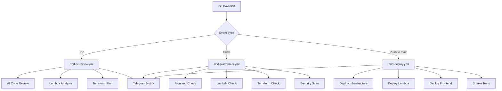

# GitHub Actions Workflow Files for DND Platform

This directory contains the GitHub Actions workflows for automating CI/CD, code reviews, and deployments.

## 📁 Workflow Files

### 1. `dnd-platform-ci.yml`
**Purpose:** Continuous Integration pipeline

**Triggers:**
- Push to `main` or `develop`
- Pull requests to `main` or `develop`
- Manual trigger

**Features:**
- Frontend validation (TypeScript, build)
- Lambda function syntax checks
- Terraform infrastructure validation
- Security scanning
- Supabase edge function checks
- Integration tests
- Telegram notifications

---

### 2. `dnd-pr-review.yml`
**Purpose:** AI-powered pull request review and automation

**Triggers:**
- PR opened, synchronized, or reopened
- PR review comments

**Features:**
- Gemini AI code review
- Lambda impact analysis
- Terraform plan preview
- Auto-labeling based on file changes
- Telegram PR notifications

---

### 3. `dnd-deploy.yml`
**Purpose:** Production deployment pipeline

**Triggers:**
- Push to `main` branch
- Manual workflow dispatch

**Features:**
- Change detection (infrastructure, Lambda, frontend)
- Terraform infrastructure deployment
- Lambda function updates
- Supabase edge function deployment
- Vercel frontend deployment
- Post-deployment smoke tests
- Telegram deployment notifications

---

## 🚀 Quick Start

### 1. Copy Workflows to Your Repository

```bash
# Copy workflow files
cp .github/workflows/dnd-*.yml /path/to/IB-DND-5e-Platform/.github/workflows/

# Copy Telegram bot script
cp scripts/telegram_bot.py /path/to/IB-DND-5e-Platform/scripts/
cp scripts/requirements.txt /path/to/IB-DND-5e-Platform/scripts/
```

### 2. Configure GitHub Secrets

Run the setup script:

```powershell
.\setup-github-actions.ps1
```

Or manually add secrets at:
`https://github.com/Brendon20011007/IB-DND-5e-Platform/settings/secrets/actions`

### 3. Enable GitHub Actions

1. Go to your repository
2. Click **Actions** tab
3. Enable workflows if prompted
4. workflows will automatically run on next push/PR

---

## 📊 Workflow Dependencies



---

## 🔧 Customization

### Modify Notification Format

Edit `telegram_bot.py`:

```python
def notify_pr_opened(self, pr_data: Dict) -> None:
    # Customize your notification message
    message = f"Your custom format here..."
    self.bot.send_message(message)
```

### Add More Lambda Functions

Update `dnd-platform-ci.yml` and `dnd-deploy.yml`:

```yaml
strategy:
  matrix:
    lambda:
      - auth_handler
      - upload_signer
      - your_new_function  # Add here
```

### Change Deployment Triggers

Edit `dnd-deploy.yml`:

```yaml
on:
  push:
    branches: [main, staging]  # Add staging
    paths:
      - 'your-custom-path/**'  # Custom paths
```

---

## 🐛 Debugging

### View Workflow Runs

```bash
gh run list --workflow="dnd-platform-ci.yml"
gh run view <run-id> --log
```

### Test Workflows Locally

Use [act](https://github.com/nektos/act):

```bash
# Install act
choco install act-cli

# Test workflow
act pull_request -W .github/workflows/dnd-pr-review.yml
```

### Check Telegram Bot

```bash
cd scripts
python telegram_bot.py
```

---

## 📈 Monitoring

### GitHub Actions Dashboard

- View all workflow runs: `https://github.com/Brendon20011007/IB-DND-5e-Platform/actions`
- Check workflow status badges
- Review logs and artifacts

### Telegram Notifications

All important events are sent to Telegram:
- ✅ Successful builds
- ❌ Failed deployments
- 🔍 PR reviews
- ⚡ Lambda errors
- 📊 Daily summaries

---

## 🔒 Security Best Practices

1. **Never commit secrets** to the repository
2. **Use least privilege** for AWS IAM roles
3. **Rotate tokens regularly** (Telegram, AWS, Vercel)
4. **Enable branch protection** on `main`
5. **Require PR reviews** before merging
6. **Use signed commits** (optional but recommended)

---

## 📚 Related Documentation

- [GitHub Actions Guide](../docs/GITHUB_ACTIONS_TELEGRAM_GUIDE.md)
- [Lambda Deployment](../../infrastructure/README.md)
- [Terraform Setup](../../infrastructure/DEPLOYMENT_CHECKLIST.md)

---

## 🤝 Contributing

When adding new workflows:

1. Test locally with `act`
2. Create a feature branch
3. Submit a PR with description
4. Wait for AI review
5. Get approval and merge

---

**Last Updated:** 2026-02-11
