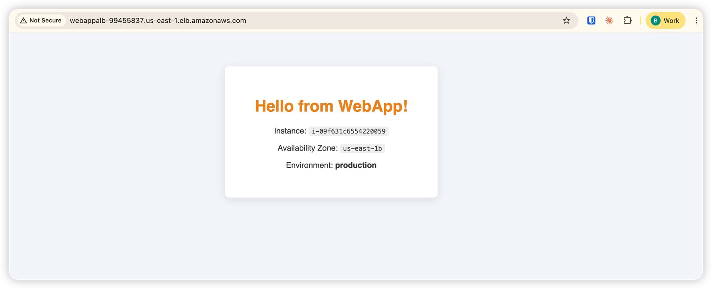
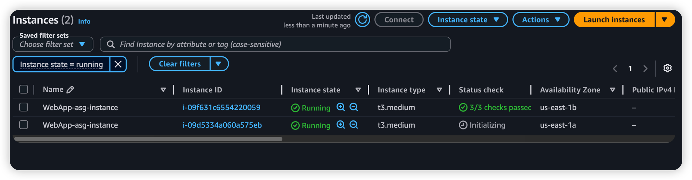

# Deployment Result — Scalable Web App with ALB & Auto Scaling

**Date:** 2026-06-08
**Region:** us-east-1
**Environment:** production

---

## All AWS Resources Created

| Resource | Name / ID | Details |
|---|---|---|
| **VPC** | `vpc-0b8ea2c5bf5093847` | `10.0.0.0/24`, pre-existing |
| **Internet Gateway** | `igw-076bdd124057cfb98` | Attached, state: available |
| **Subnet (us-east-1a)** | `subnet-017d9e213cb1cd657` | `10.0.0.0/28`, public, 9 IPs available |
| **Subnet (us-east-1b)** | `subnet-0ff2ce1b2900affd6` | `10.0.0.16/28`, public, 10 IPs available, Terraform-managed |
| **Route Table (public)** | `rtb-09ef904e894338594` | `0.0.0.0/0 → igw-076bdd124057cfb98`, both subnets |
| **Route Table (main)** | `rtb-090756b8feaaaa054` | Local only, no subnets assigned |
| **Route Table Association** | `rtbassoc-07c59c7dcca5627a1` | us-east-1b → `rtb-09ef904e894338594` |
| **Security Group** | `sg-0638b502cb8e1f90d` | `WebApp-sg` — SSH/HTTP/HTTPS inbound, all outbound |
| **EC2 Key Pair** | `WebApp-key-pair` | RSA, PEM format |
| **Launch Template** | `lt-0aefb49318f24eb4d` | `WebAppTemplate` v1 — `t3.medium`, Amazon Linux 2, Apache |
| **Application Load Balancer** | `WebAppALB` | Internet-facing, HTTP:80, active across us-east-1a + us-east-1b |
| **ALB Listener** | `aada1be380ade6ca` | HTTP:80 → forwards to `WebApp-tg` |
| **Target Group** | `WebApp-tg` | HTTP:80, health check `GET /` → 200, threshold 2/3 |
| **Auto Scaling Group** | `WebAppASG` | Desired: 1, Min: 1, Max: 4 |
| **Scale-Out Policy** | `WebApp-scale-out` | +1 at CPU 60–80%, +2 at CPU >80% |
| **Scale-In Policy** | `WebApp-scale-in` | −1 at CPU <40% |
| **CloudWatch Alarm (high)** | `WebApp-cpu-high` | State: **OK** — avg CPU >60% for 2×60s |
| **CloudWatch Alarm (low)** | `WebApp-cpu-low` | State: **ALARM** — avg CPU <40% for 2×60s |

---

## Key Outputs

| Output | Value |
|---|---|
| **ALB DNS** | `http://WebAppALB-99455837.us-east-1.elb.amazonaws.com` |
| **ALB ARN** | `arn:aws:elasticloadbalancing:us-east-1:022499047467:loadbalancer/app/WebAppALB/e0feccf38795fa7e` |
| **Target Group ARN** | `arn:aws:elasticloadbalancing:us-east-1:022499047467:targetgroup/WebApp-tg/0eaf3730978def43` |
| **ASG Name** | `WebAppASG` |
| **Launch Template ID** | `lt-0aefb49318f24eb4d` (v1) |
| **Security Group ID** | `sg-0638b502cb8e1f90d` |
| **AMI** | `ami-046b36f55e189564a` (Amazon Linux 2, us-east-1) |

---

## Networking & Routing

### VPC

| Field | Value |
|---|---|
| **VPC ID** | `vpc-0b8ea2c5bf5093847` |
| **CIDR Block** | `10.0.0.0/24` |
| **Internet Gateway** | `igw-076bdd124057cfb98` (state: available) |

### Subnets

| Subnet | AZ | CIDR | Available IPs | Public IP on Launch | Managed by |
|---|---|---|---|---|---|
| `subnet-017d9e213cb1cd657` | us-east-1a | `10.0.0.0/28` | 9 | Yes | Pre-existing |
| `subnet-0ff2ce1b2900affd6` | us-east-1b | `10.0.0.16/28` | 10 | Yes | Terraform (`aws_subnet.web_1b`) |

### Route Tables

| Route Table | Type | Destination | Target | State | Subnets |
|---|---|---|---|---|---|
| `rtb-09ef904e894338594` | Public | `10.0.0.0/24` | local | active | us-east-1a, us-east-1b |
| `rtb-09ef904e894338594` | Public | `0.0.0.0/0` | `igw-076bdd124057cfb98` | active | us-east-1a, us-east-1b |
| `rtb-090756b8feaaaa054` | Main (private) | `10.0.0.0/24` | local | active | — (no subnets assigned) |

> Both subnets share the public route table so EC2 instances can reach the internet via the IGW during boot — required for `yum install httpd` in user data.

---

## CloudWatch Alarms Status

| Alarm | State | Metric | Threshold | Action |
|---|---|---|---|---|
| `WebApp-cpu-high` | ✅ OK | avg CPUUtilization | > 60% for 2×60s | Scale out (+1 or +2) |
| `WebApp-cpu-low` | ⚠️ ALARM | avg CPUUtilization | < 40% for 2×60s | Scale in (−1) |

> `cpu-low` is in ALARM because the instance is idle with no traffic — CPU stays near 0%. This causes the ASG to scale in to `desired=1`. Consider raising `evaluation_periods` or adding a `scale_in_cooldown` to prevent premature scale-in under low load.

---

## Implementation Result

### Web App — Live via ALB



> The app responds through the Application Load Balancer, displaying the serving EC2 instance ID (`i-09f631c6554220059`) and its Availability Zone (`us-east-1b`).

---

### EC2 Instances — Auto Scaling Group



> Two `t3.medium` instances named `WebApp-asg-instance` running across both availability zones — `i-09f631c6554220059` in `us-east-1b` (3/3 checks passed) and `i-09d5334a060a575eb` in `us-east-1a` — managed by the Auto Scaling Group `WebAppASG`.

---

## Architecture Overview

```
                          Internet
                              │
                              ▼
                   Internet Gateway
                   igw-076bdd124057cfb98
                              │
                              ▼
              Application Load Balancer
                       WebAppALB
                    (internet-facing)
                    HTTP:80  •  active
                    ┌────────┴────────┐
                    │                 │
             us-east-1a         us-east-1b
          10.0.0.0/28         10.0.0.16/28
                    │                 │
                    └────────┬────────┘
                             │
                             ▼
                    Target Group (WebApp-tg)
                    Health: GET / → 200
                             │
                             ▼
               Auto Scaling Group (WebAppASG)
               Desired: 1 | Min: 1 | Max: 4
               Launch Template: t3.medium
                    ┌────────┴────────┐
                    │                 │
             us-east-1a         us-east-1b
        i-09d5334a060a575eb  i-09f631c6554220059
           t3.medium             t3.medium
           Apache httpd          Apache httpd

CloudWatch Alarms
   WebApp-cpu-high (OK)  ──►  scale-out policy  (+1 / +2)
   WebApp-cpu-low (ALARM)──►  scale-in  policy  (−1)
```
