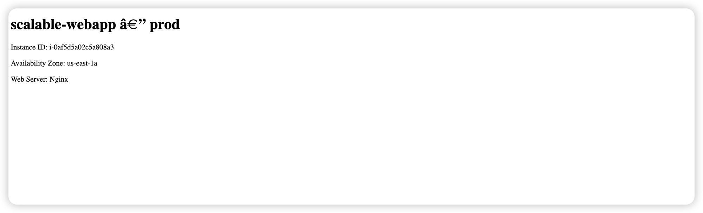
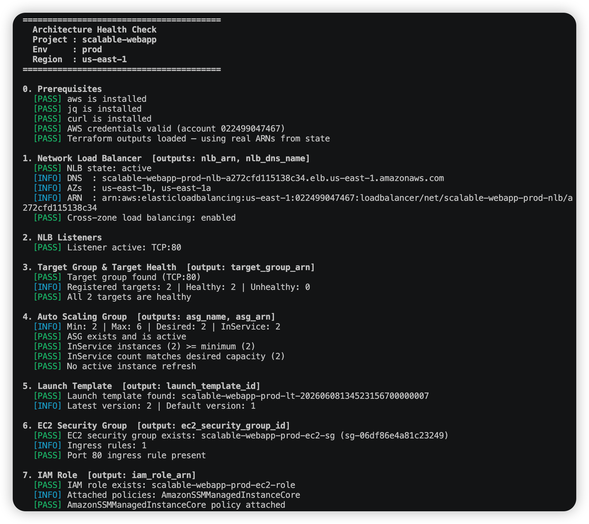
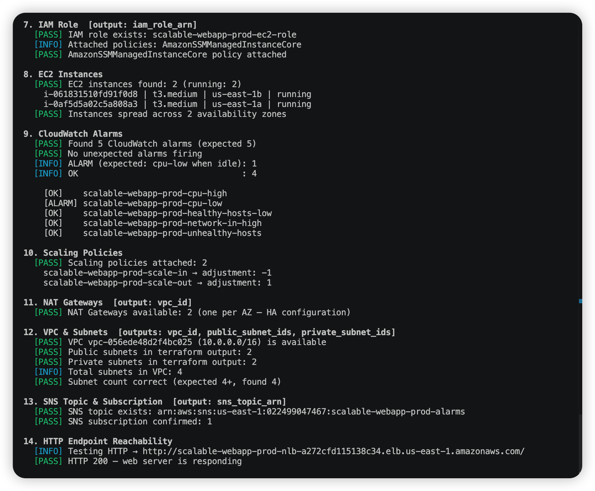
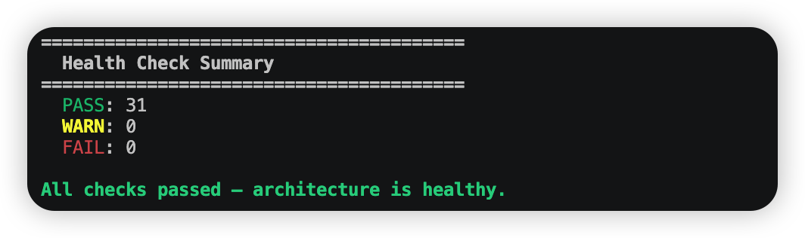

# Deployment Result — Scalable Web App with NLB & Auto Scaling

**Date:** 2026-06-08
**Region:** us-east-1
**Environment:** prod
**Account:** 022499047467
**Terraform Resources:** 33 managed (+ VPC module sub-resources)

---

## Overall Status

| Layer | Status | Notes |
|---|---|---|
| Network Load Balancer | HEALTHY | State: active · cross-zone: ON · deletion protection: ON |
| NLB Listener | HEALTHY | TCP:80 forwarding to target group |
| Target Group | HEALTHY | 2/2 targets healthy |
| Auto Scaling Group | HEALTHY | 2 InService across 2 AZs |
| EC2 Instances | HEALTHY | 2 running — us-east-1a + us-east-1b |
| NAT Gateways | HEALTHY | 2 available (one per AZ — HA) |
| VPC & Subnets | HEALTHY | 4 subnets in 2 AZs |
| Security Groups | HEALTHY | EC2 SG restricts inbound to NLB SG only |
| IAM Role | HEALTHY | `AmazonSSMManagedInstanceCore` attached |
| SNS Subscription | HEALTHY | Email confirmed |
| CloudWatch Alarms | WARNING | `cpu-low` ALARM (expected at idle); `network-in-high` INSUFFICIENT_DATA (normal — new deployment) |
| WAF Web ACL | HEALTHY | Provisioned · not associated (NLB is Layer 4) |

---

## All AWS Resources Created

| # | Resource Type | Name / ID | ARN / Details |
|---|---|---|---|
| 1 | Network Load Balancer | `scalable-webapp-prod-nlb` | `arn:aws:elasticloadbalancing:us-east-1:022499047467:loadbalancer/net/scalable-webapp-prod-nlb/a272cfd115138c34` |
| 2 | NLB Listener | `TCP:80` | `arn:aws:elasticloadbalancing:us-east-1:022499047467:listener/net/scalable-webapp-prod-nlb/a272cfd115138c34/e581d7e2557e7328` |
| 3 | Target Group | `scalable-webapp-prod-tg` | `arn:aws:elasticloadbalancing:us-east-1:022499047467:targetgroup/scalable-webapp-prod-tg/5758ddbba0eae8c5` |
| 4 | Auto Scaling Group | `scalable-webapp-prod-asg` | `arn:aws:autoscaling:us-east-1:022499047467:autoScalingGroup:f2e9c589-0010-4537-8948-657b036fac44:autoScalingGroupName/scalable-webapp-prod-asg` |
| 5 | Launch Template | `lt-097e8ffc95815d2a6` | `scalable-webapp-prod-lt-20260608134523156700000007` (latest v2) |
| 6 | EC2 Instance | `i-061831510fd91f0d8` | t3.medium · us-east-1b · 10.0.4.222 · ami-00fa360e28f425da0 |
| 7 | EC2 Instance | `i-0af5d5a02c5a808a3` | t3.medium · us-east-1a · 10.0.3.185 · ami-00fa360e28f425da0 |
| 8 | Security Group (EC2) | `scalable-webapp-prod-ec2-sg` | `sg-06df86e4a81c23249` |
| 9 | Security Group (NLB) | `scalable-webapp-prod-nlb-sg` | `sg-0df61ec01f424402e` |
| 10 | VPC | `scalable-webapp-prod-vpc` | `vpc-056ede48d2f4bc025` · 10.0.0.0/16 |
| 11 | Public Subnet (us-east-1a) | `scalable-webapp-prod-vpc-public-us-east-1a` | `subnet-0fef3b0efc590b320` · 10.0.1.0/24 |
| 12 | Public Subnet (us-east-1b) | `scalable-webapp-prod-vpc-public-us-east-1b` | `subnet-07241f5c4e1d486f2` · 10.0.2.0/24 |
| 13 | Private Subnet (us-east-1a) | `scalable-webapp-prod-vpc-private-us-east-1a` | `subnet-01ccc3a72ba695b1e` · 10.0.3.0/24 |
| 14 | Private Subnet (us-east-1b) | `scalable-webapp-prod-vpc-private-us-east-1b` | `subnet-049bf253993458f95` · 10.0.4.0/24 |
| 15 | Internet Gateway | `scalable-webapp-prod-vpc` | `igw-0d864a147907cc0bd` |
| 16 | NAT Gateway (us-east-1a) | `scalable-webapp-prod-vpc-us-east-1a` | `nat-07e9c73b459efdc49` · EIP 34.238.75.178 |
| 17 | NAT Gateway (us-east-1b) | `scalable-webapp-prod-vpc-us-east-1b` | `nat-07a86629dcf8ab8e9` · EIP 3.224.162.224 |
| 18 | Route Table (public) | `scalable-webapp-prod-vpc-public` | `rtb-0d60874912fbb3b1a` |
| 19 | Route Table (private-1a) | `scalable-webapp-prod-vpc-private-us-east-1a` | `rtb-01b2d6b82ac6d27f4` |
| 20 | Route Table (private-1b) | `scalable-webapp-prod-vpc-private-us-east-1b` | `rtb-0c11d4949a60ffc7e` |
| 21 | Scaling Policy (scale-out) | `scalable-webapp-prod-scale-out` | +1 instance · 300 s cooldown |
| 22 | Scaling Policy (scale-in) | `scalable-webapp-prod-scale-in` | −1 instance · 300 s cooldown |
| 23 | CloudWatch Alarm | `scalable-webapp-prod-cpu-high` | `arn:aws:cloudwatch:us-east-1:022499047467:alarm:scalable-webapp-prod-cpu-high` |
| 24 | CloudWatch Alarm | `scalable-webapp-prod-cpu-low` | `arn:aws:cloudwatch:us-east-1:022499047467:alarm:scalable-webapp-prod-cpu-low` |
| 25 | CloudWatch Alarm | `scalable-webapp-prod-unhealthy-hosts` | `arn:aws:cloudwatch:us-east-1:022499047467:alarm:scalable-webapp-prod-unhealthy-hosts` |
| 26 | CloudWatch Alarm | `scalable-webapp-prod-healthy-hosts-low` | `arn:aws:cloudwatch:us-east-1:022499047467:alarm:scalable-webapp-prod-healthy-hosts-low` |
| 27 | CloudWatch Alarm | `scalable-webapp-prod-network-in-high` | `arn:aws:cloudwatch:us-east-1:022499047467:alarm:scalable-webapp-prod-network-in-high` |
| 28 | SNS Topic | `scalable-webapp-prod-alarms` | `arn:aws:sns:us-east-1:022499047467:scalable-webapp-prod-alarms` |
| 29 | SNS Subscription | Email confirmed | brendon.ang@aterpise.com |
| 30 | IAM Role | `scalable-webapp-prod-ec2-role` | `arn:aws:iam::022499047467:role/scalable-webapp-prod-ec2-role` |
| 31 | IAM Instance Profile | `scalable-webapp-prod-ec2-profile` | `arn:aws:iam::022499047467:instance-profile/scalable-webapp-prod-ec2-profile` |
| 32 | IAM Policy Attachment | `AmazonSSMManagedInstanceCore` | AWS managed policy |
| 33 | WAF Web ACL | `scalable-webapp-prod-waf` | `arn:aws:wafv2:us-east-1:022499047467:regional/webacl/scalable-webapp-prod-waf/c119df17-f829-4305-9de1-fc2b3f70eb77` |

---

## Key Outputs

| Output | Value |
|---|---|
| `nlb_dns_name` | `scalable-webapp-prod-nlb-a272cfd115138c34.elb.us-east-1.amazonaws.com` |
| `nlb_arn` | `arn:aws:elasticloadbalancing:us-east-1:022499047467:loadbalancer/net/scalable-webapp-prod-nlb/a272cfd115138c34` |
| `asg_name` | `scalable-webapp-prod-asg` |
| `asg_arn` | `arn:aws:autoscaling:us-east-1:022499047467:autoScalingGroup:f2e9c589-0010-4537-8948-657b036fac44:autoScalingGroupName/scalable-webapp-prod-asg` |
| `launch_template_id` | `lt-097e8ffc95815d2a6` |
| `vpc_id` | `vpc-056ede48d2f4bc025` |
| `public_subnet_ids` | `subnet-0fef3b0efc590b320`, `subnet-07241f5c4e1d486f2` |
| `private_subnet_ids` | `subnet-01ccc3a72ba695b1e`, `subnet-049bf253993458f95` |
| `ec2_security_group_id` | `sg-06df86e4a81c23249` |
| `iam_role_arn` | `arn:aws:iam::022499047467:role/scalable-webapp-prod-ec2-role` |
| `sns_topic_arn` | `arn:aws:sns:us-east-1:022499047467:scalable-webapp-prod-alarms` |
| `target_group_arn` | `arn:aws:elasticloadbalancing:us-east-1:022499047467:targetgroup/scalable-webapp-prod-tg/5758ddbba0eae8c5` |
| `waf_web_acl_arn` | `arn:aws:wafv2:us-east-1:022499047467:regional/webacl/scalable-webapp-prod-waf/c119df17-f829-4305-9de1-fc2b3f70eb77` |

Access the app at: `http://scalable-webapp-prod-nlb-a272cfd115138c34.elb.us-east-1.amazonaws.com`

---

## Networking & Routing

### VPC

| Field | Value |
|---|---|
| VPC ID | `vpc-056ede48d2f4bc025` |
| CIDR Block | `10.0.0.0/16` |
| State | available |
| Internet Gateway | `igw-0d864a147907cc0bd` (state: available) |
| DNS Hostnames | enabled |
| DNS Support | enabled |

### Subnets

| Subnet ID | Name | AZ | CIDR | Tier | Available IPs |
|---|---|---|---|---|---|
| `subnet-0fef3b0efc590b320` | `…-public-us-east-1a` | us-east-1a | 10.0.1.0/24 | Public (NLB) | 249 |
| `subnet-07241f5c4e1d486f2` | `…-public-us-east-1b` | us-east-1b | 10.0.2.0/24 | Public (NLB) | 249 |
| `subnet-01ccc3a72ba695b1e` | `…-private-us-east-1a` | us-east-1a | 10.0.3.0/24 | Private (EC2) | 250 |
| `subnet-049bf253993458f95` | `…-private-us-east-1b` | us-east-1b | 10.0.4.0/24 | Private (EC2) | 250 |

### Route Tables

| Route Table | Name | Subnet(s) | Destination | Target |
|---|---|---|---|---|
| `rtb-0d60874912fbb3b1a` | public | `subnet-0fef3b0efc590b320`, `subnet-07241f5c4e1d486f2` | 10.0.0.0/16 | local |
| `rtb-0d60874912fbb3b1a` | public | — | 0.0.0.0/0 | `igw-0d864a147907cc0bd` |
| `rtb-01b2d6b82ac6d27f4` | private-us-east-1a | `subnet-01ccc3a72ba695b1e` | 10.0.0.0/16 | local |
| `rtb-01b2d6b82ac6d27f4` | private-us-east-1a | — | 0.0.0.0/0 | `nat-07e9c73b459efdc49` |
| `rtb-0c11d4949a60ffc7e` | private-us-east-1b | `subnet-049bf253993458f95` | 10.0.0.0/16 | local |
| `rtb-0c11d4949a60ffc7e` | private-us-east-1b | — | 0.0.0.0/0 | `nat-07a86629dcf8ab8e9` |

### NAT Gateways

| NAT Gateway ID | AZ | Subnet | Elastic IP | State |
|---|---|---|---|---|
| `nat-07e9c73b459efdc49` | us-east-1a | `subnet-0fef3b0efc590b320` (public) | `34.238.75.178` | available |
| `nat-07a86629dcf8ab8e9` | us-east-1b | `subnet-07241f5c4e1d486f2` (public) | `3.224.162.224` | available |

---

## Architecture Overview

```
                    ┌──────────────────────────────────────┐
                    │              Internet                │
                    └───────────────────┬──────────────────┘
                                        │
                    ┌───────────────────▼──────────────────┐
                    │         Internet Gateway             │
                    │       igw-0d864a147907cc0bd          │
                    └───────────────────┬──────────────────┘
                                        │
                    ┌───────────────────▼──────────────────┐
                    │      Network Load Balancer (NLB)     │
                    │  scalable-webapp-prod-nlb  •  TCP 80 │
                    │  SG: sg-0df61ec01f424402e            │
                    │  Cross-zone: ON • Deletion prot: ON  │
                    └──────────┬────────────────┬──────────┘
                               │                │
          ┌────────────────────▼──┐        ┌────▼──────────────────┐
          │      us-east-1a       │        │      us-east-1b       │
          │  Public 10.0.1.0/24   │        │  Public 10.0.2.0/24   │
          │                       │        │                       │
          │  Private 10.0.3.0/24  │        │  Private 10.0.4.0/24  │
          │  ┌─────────────────┐  │        │  ┌─────────────────┐  │
          │  │ i-0af5d5a02c5a8 │  │        │  │ i-061831510fd91 │  │
          │  │ 10.0.3.185      │  │        │  │ 10.0.4.222      │  │
          │  │ t3.medium Nginx │  │        │  │ t3.medium Nginx │  │
          │  │ InService/Healthy│ │        │  │ InService/Healthy│ │
          │  └────────┬────────┘  │        │  └────────┬────────┘  │
          │           │ egress    │        │           │ egress    │
          │  ┌────────▼────────┐  │        │  ┌────────▼────────┐  │
          │  │  NAT GW 1a      │  │        │  │  NAT GW 1b      │  │
          │  │  34.238.75.178  │  │        │  │  3.224.162.224  │  │
          └──┴─────────────────┴──┘        └──┴─────────────────┴──┘

  ┌──────────────────────────────────────────────────────────────────┐
  │  CloudWatch (5 alarms) ─── SNS ─── brendon.ang@aterpise.com      │
  │  WAF Web ACL: scalable-webapp-prod-waf (ready for ALB use)       │
  └──────────────────────────────────────────────────────────────────┘
```

**Traffic flow:** Internet → IGW → NLB (TCP:80, public subnets) → Target Group → EC2 Nginx (private subnets) → NAT GW → Internet (outbound only)

---

## Target Health

| Instance ID | AZ | Private IP | Port | State |
|---|---|---|---|---|
| `i-061831510fd91f0d8` | us-east-1b | `10.0.4.222` | 80 | **healthy** |
| `i-0af5d5a02c5a808a3` | us-east-1a | `10.0.3.185` | 80 | **healthy** |

**2 / 2 healthy.** No administrative overrides active on either target.

---

## Auto Scaling Group Status

| Attribute | Value |
|---|---|
| ASG Name | `scalable-webapp-prod-asg` |
| Min / Desired / Max | 2 / 2 / 6 |
| Health Check Type | ELB |
| Health Check Grace Period | 300 s |
| AZs | us-east-1a, us-east-1b |
| Launch Template | `lt-097e8ffc95815d2a6` v2 |
| Instance Refresh Strategy | Rolling (50% min healthy) |

### Current Instances

| Instance ID | Type | AZ | Private IP | Lifecycle State | Health | Launch Time (UTC) |
|---|---|---|---|---|---|---|
| `i-061831510fd91f0d8` | t3.medium | us-east-1b | 10.0.4.222 | InService | Healthy | 2026-06-08 14:07 |
| `i-0af5d5a02c5a808a3` | t3.medium | us-east-1a | 10.0.3.185 | InService | Healthy | 2026-06-08 14:13 |

### Recent Scaling Activity

| Time (UTC) | Event | Instance | Cause |
|---|---|---|---|
| 14:13:43 | Launch | `i-0af5d5a02c5a808a3` (us-east-1a) | Replaced unhealthy `i-04c9ec62c31a5e231` |
| 14:13:41 | Terminate | `i-04c9ec62c31a5e231` (us-east-1a) | ELB health check failure |
| 14:07:36 | Launch | `i-061831510fd91f0d8` (us-east-1b) | Replaced unhealthy `i-08ca8797866bb70d6` |
| 14:07:35 | Terminate | `i-08ca8797866bb70d6` (us-east-1b) | ELB health check failure |
| 14:01:41 | Launch | `i-04c9ec62c31a5e231` (us-east-1a) | Replaced unhealthy instance on initial boot |

> ELB health check failures on early instances are expected — they occur while Nginx is still being installed by user-data. The ASG self-healed by replacing them. Current instances are stable.

---

## Security Group Rules

### NLB SG — `sg-0df61ec01f424402e` (`scalable-webapp-prod-nlb-sg`)

| Direction | Protocol | Port | Source |
|---|---|---|---|
| Inbound | TCP | 80 | 0.0.0.0/0 |
| Inbound | TCP | 443 | 0.0.0.0/0 |
| Outbound | All | All | 0.0.0.0/0 |

### EC2 SG — `sg-06df86e4a81c23249` (`scalable-webapp-prod-ec2-sg`)

| Direction | Protocol | Port | Source |
|---|---|---|---|
| Inbound | TCP | 80 | `sg-0df61ec01f424402e` (NLB SG only) |
| Outbound | All | All | 0.0.0.0/0 |

---

## CloudWatch Alarms Status

| Alarm | Metric | Threshold | Live State | Action |
|---|---|---|---|---|
| `scalable-webapp-prod-cpu-high` | CPUUtilization avg | > 70% (2 × 60 s) | **OK** | Scale out +1 |
| `scalable-webapp-prod-cpu-low` | CPUUtilization avg | < 30% (2 × 60 s) | **ALARM** | Scale in −1 |
| `scalable-webapp-prod-unhealthy-hosts` | UnHealthyHostCount max | ≥ 1 (2 × 60 s) | **OK** | SNS alert |
| `scalable-webapp-prod-healthy-hosts-low` | HealthyHostCount min | < 2 (2 × 60 s) | **OK** | SNS alert |
| `scalable-webapp-prod-network-in-high` | ProcessedBytes sum | > 1 GB/5 min (2 × 300 s) | INSUFFICIENT_DATA | SNS alert |

**Notes:**

- `cpu-low` in **ALARM**: CPU is ~0.017% at idle. Normal for an unloaded server. The scale-in policy fires, but `MinSize = 2` prevents any instance removal. Will self-resolve once real traffic arrives.
- `network-in-high` in **INSUFFICIENT_DATA**: NLB hasn't yet accumulated 2 full 5-minute evaluation periods of `ProcessedBytes` data. Will resolve to OK automatically under normal traffic.

---

## IAM Configuration

| Attribute | Value |
|---|---|
| Role Name | `scalable-webapp-prod-ec2-role` |
| Role ARN | `arn:aws:iam::022499047467:role/scalable-webapp-prod-ec2-role` |
| Instance Profile | `scalable-webapp-prod-ec2-profile` |
| Attached Policy | `AmazonSSMManagedInstanceCore` |

SSM Session Manager is enabled — instances are reachable without a bastion host.

---

## SNS Notifications

| Attribute | Value |
|---|---|
| Topic | `scalable-webapp-prod-alarms` |
| Topic ARN | `arn:aws:sns:us-east-1:022499047467:scalable-webapp-prod-alarms` |
| Subscription | Email — `brendon.ang@aterpise.com` |
| Subscription Status | **Confirmed** |

---

## WAF Web ACL

| Attribute | Value |
|---|---|
| Name | `scalable-webapp-prod-waf` |
| ID | `c119df17-f829-4305-9de1-fc2b3f70eb77` |
| ARN | `arn:aws:wafv2:us-east-1:022499047467:regional/webacl/scalable-webapp-prod-waf/c119df17-f829-4305-9de1-fc2b3f70eb77` |
| Rules | `AWSManagedRulesCommonRuleSet` (priority 1), `AWSManagedRulesKnownBadInputsRuleSet` (priority 2) |
| Associated To | None — NLB is Layer 4 and cannot be associated with WAFv2. Associate with an ALB ARN if added in front. |

---

## Live Web App


> HTTP 200 response served by Nginx on instance `i-0af5d5a02c5a808a3` in `us-east-1a`. The NLB round-robins requests across both instances.

---

## Health Check Run — `./health_check.sh`

### Sections 0 – 7 (Prerequisites → IAM Role)



### Sections 8 – 14 (EC2 Instances → HTTP Endpoint)



### Final Score



| Result | Count |
|---|---|
| PASS | 31 |
| WARN | 0 |
| FAIL | 0 |

All 31 checks passed — architecture is healthy.

---

## Issues Resolved During Deployment

| Issue | Root Cause | Fix Applied |
|---|---|---|
| `ami_id` invalid on first apply | Trailing space in `prod.tfvars`: `"ami-00fa360e28f425da0 "` | Removed trailing space; launch template updated to v2 |
| WAFv2 association rejected | WAFv2 cannot be associated with NLB (Layer 4) | Removed `aws_wafv2_web_acl_association`; WAF ACL still provisioned for future ALB use |
| All targets unhealthy | `security_groups` not set on `aws_lb` — NLB packets arrived from untagged IPs; EC2 SG source-matched NLB SG but NLB had no SG attached | Added `security_groups = [aws_security_group.nlb.id]` to `aws_lb.web` |

---

## Audit Summary

| Check | Result | Detail |
|---|---|---|
| Terraform-managed resources | 33 | All confirmed present in live AWS |
| NLB DNS name | confirmed | `scalable-webapp-prod-nlb-a272cfd115138c34.elb.us-east-1.amazonaws.com` |
| NLB state | active | Cross-zone ON · deletion protection ON |
| Target health | 2 / 2 healthy | Both passing TCP:80 health checks |
| ASG capacity | 2 InService | Desired 2 · 1 per AZ (us-east-1a + us-east-1b) |
| Alarms in ALARM state | 1 | `cpu-low` — expected at idle; scale-in blocked by `MinSize = 2` |
| Alarms in INSUFFICIENT_DATA | 1 | `network-in-high` — normal for new deployment |
| Multi-AZ spread | confirmed | 1 instance per AZ |
| Cross-zone load balancing | enabled | Confirmed via NLB attributes |
| Deletion protection | enabled | NLB protected from accidental `terraform destroy` |
| SSM access | confirmed | `AmazonSSMManagedInstanceCore` attached to EC2 role |
| SNS subscription | confirmed | Email subscription active and confirmed |
| WAF | provisioned | Ready for ALB association when Layer 7 is added |
